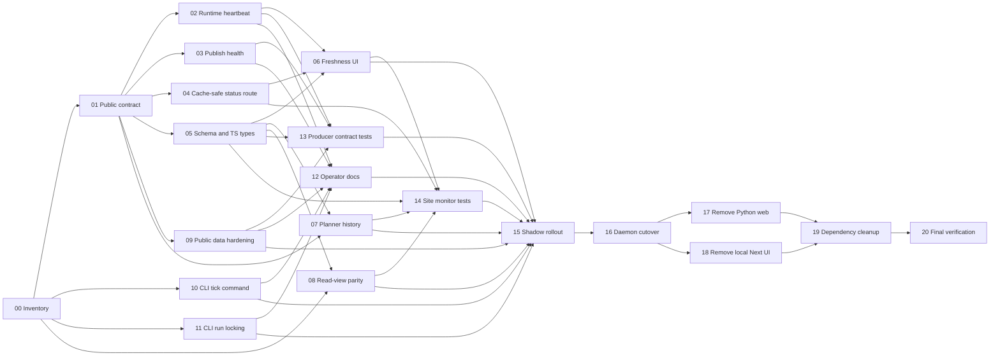

# Steward Dashboard Migration

Status: In Progress
Date: 2026-07-13
Last updated: 2026-07-13

Current execution state: subplans 00 through 12 are complete on `main`; Wave 3
remains active for producer contract tests and site monitor tests. The
capability matrix is checked in at
[00-capability-matrix.md](00-capability-matrix.md), and the v3 contract is
checked in at `steward/schema/fixtures/public-monitor-v3/`.

## Objective

Remove the local Steward FastAPI and Next.js dashboard stack. Steward becomes
an outbound-only daemon controlled through its CLI, while `site/next` becomes
the only dashboard and monitors sanitized state published by the daemon.

## Target Architecture

```text
local operator
    |
    v
Steward CLI ------> SQLite, wakeups, and task artifacts
                         ^
                         |
                   Steward daemon
                         |
                         v
              public mirror projector
                         |
                  atomic SSH/rsync
                         |
                         v
                site/next dashboard
```

The site is read-only. It must not gain an authenticated or unauthenticated
control channel back to the daemon as part of this migration.

## Scope

- Make the public mirror a versioned and observable daemon-monitoring contract.
- Complete monitoring parity in `site/next` before deleting the local UI.
- Move every retained operator action to safe CLI commands.
- Harden public redaction, artifact limits, cache behavior, and schema handling.
- Remove `steward/web-ui`, `coquic_steward.web`, and their dependencies.

## Non-Goals

- Remote task creation or daemon control from the public site.
- Publishing unredacted prompts, environment data, credentials, or local paths.
- Replacing SQLite or the scheduler wakeup mechanism.
- Reworking unrelated site pages or the Steward task execution pipeline.
- Preserving every local debugger convenience when it is unsafe to publish.

## Migration Gates

1. The site shows active progress within 60 seconds of a stored state change.
2. The site distinguishes live, delayed, stale, offline, and incompatible data.
3. The public schema has producer and consumer contract tests.
4. Public mode cannot expose raw transcripts without an explicit private-target
   design outside this migration.
5. CLI commands cover scheduler wakeup, signal fetch, task enqueue, task status,
   task timeline, invariant audit, and safe direct execution.
6. A shadow run proves monitoring parity before local web code is removed.
7. Steward continues executing when the site or publisher is unavailable.

## Dependency Graph



## Parallel Execution Waves

| Wave | Subplans | Parallel Opportunity |
| --- | --- | --- |
| 0 | 00, then 01 | Establish facts and freeze the contract first. |
| 1 | 02, 03, 04, 05, 09, 10, 11 | Seven independent workstreams after the contract; CLI work can start after inventory. |
| 2 | 06, 07, 08, 13 | Site views and producer tests can run concurrently. |
| 3 | 12, 14 | Documentation and site testing are independent once their inputs land. |
| 4 | 15 | Single coordinated shadow-run gate. |
| 5 | 16 | Switch the daemon entrypoint only after the gate passes. |
| 6 | 17, 18 | Python web removal and local Next.js removal can run in parallel branches. |
| 7 | 19, then 20 | Consolidate dependencies, then perform final verification. |

## Subplan Index

| ID | Subplan | Depends On | Status |
| --- | --- | --- | --- |
| 00 | [Current-state inventory](00-current-state-inventory.md) | None | Complete |
| 01 | [Public monitoring contract](01-public-monitoring-contract.md) | 00 | Complete |
| 02 | [Daemon runtime heartbeat](02-daemon-runtime-heartbeat.md) | 01 | Complete |
| 03 | [Publisher health and retry state](03-publisher-health.md) | 01 | Complete |
| 04 | [Cache-safe site status endpoint](04-cache-safe-status-endpoint.md) | 01 | Complete |
| 05 | [Schema and TypeScript ownership](05-schema-and-types.md) | 01 | Complete |
| 06 | [Freshness and offline UI](06-site-freshness-ui.md) | 02, 04, 05 | Complete |
| 07 | [Standalone planner history](07-site-planner-history.md) | 01, 05 | Complete |
| 08 | [Read-view parity](08-site-read-view-parity.md) | 00, 05 | Complete |
| 09 | [Public data hardening](09-public-data-hardening.md) | 01 | Complete |
| 10 | [CLI scheduler tick](10-cli-scheduler-tick.md) | 00 | Complete |
| 11 | [CLI direct-run locking](11-cli-run-locking.md) | 00 | Complete |
| 12 | [Configuration and operator docs](12-operator-docs-and-config.md) | 02, 03, 09, 10, 11 | Complete |
| 13 | [Producer contract tests](13-producer-contract-tests.md) | 02, 03, 05, 09 | Complete |
| 14 | [Site monitor tests](14-site-monitor-tests.md) | 04, 05, 06, 07, 08 | In Progress |
| 15 | [Shadow rollout](15-shadow-rollout.md) | 06-14 as graphed | Pending |
| 16 | [Daemon entrypoint cutover](16-daemon-entrypoint-cutover.md) | 15 | Pending |
| 17 | [Remove Python web runtime](17-remove-python-web-runtime.md) | 16 | Pending |
| 18 | [Remove local Next.js UI](18-remove-local-next-ui.md) | 16 | Pending |
| 19 | [Dependency and documentation cleanup](19-dependency-cleanup.md) | 17, 18 | Pending |
| 20 | [Final verification and release](20-final-verification.md) | 19 | Pending |

## Coordination Rules

- Each subplan should land as one Conventional Commit unless its validation
  requires a preparatory test-only commit.
- A subplan may start only when all listed dependencies are merged.
- Parallel branches must avoid editing shared schema and generated type files
  without coordinating through subplan 05.
- Subplans 17 and 18 must not edit `steward/README.md`; subplan 19 owns the
  final dependency and documentation consolidation.
- Update this index as subplans move through Pending, In Progress, Blocked, and
  Complete.
